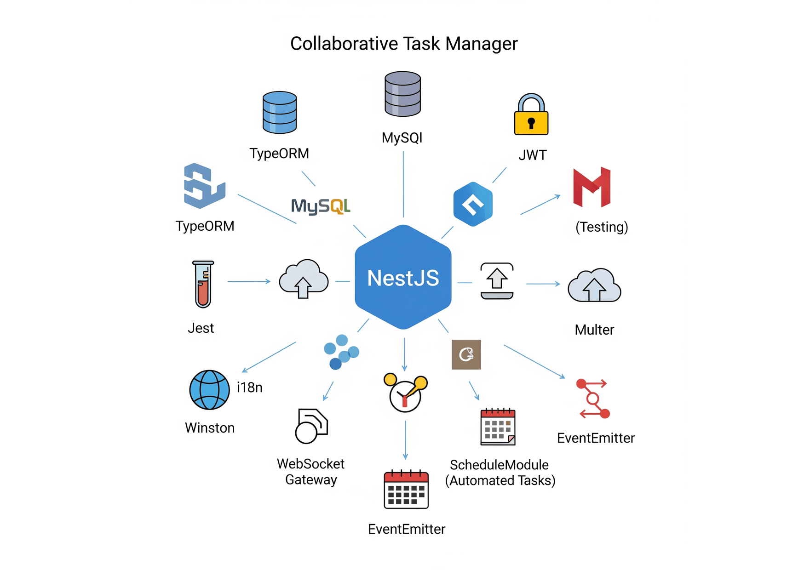

# Collaborative Task Manager



A collaborative platform to create, manage, and discuss ideas — inspired by Reddit and Twitter, tailored for team productivity.


---

## Architecture Style: HMVC (Hierarchical Model-View-Controller)

This project is built using the **HMVC** (Hierarchical MVC) pattern powered by **NestJS**. Each feature is encapsulated in its own module — such as `auth`, `board`, `card`, `list`, and `user` — following a **self-contained, modular design** that promotes:

- Better code organization
- Easier testing and maintenance
- Reusability and scalability

Each module contains its own controller, service, and data layer, aligning with NestJS’s best practices for enterprise-grade applications.


---

## User Stories

- Authenticate users
- Users can **Create**, **Read**, **Update**, and **Delete** (CRUD):
  - Boards
  - Lists
  - Cards (Tasks)
- send deadline notifications
- Upload files using **Multer**
- Log card changes using **Winston**

---

## Stack

- **Database:** MySQL
- **Backend Framework:** NestJS (REST API)
- **ORM:** TypeORM

---

## Features & Techniques Implemented

This project includes a variety of advanced backend features to ensure scalability, performance, and maintainability:

- **JWT Authentication**  
  Secure user authentication using JSON Web Tokens.

- **WebSocket Support**  
  Real-time communication with clients using WebSockets.

- **HMVC Architecture**  
  Modular, scalable, and maintainable structure using NestJS modules

- **Subscriber Pattern**  
  Entity Subscribers in TypeORM to trigger logic after data changes.

- **Rate Limiting**  
  Protects the API from abuse and excessive requests.

- **CORS & CSRF Protection**
  - CORS enabled for safe API access from different origins
  - CSRF protection for enhanced security in forms and state-changing requests

- **Testing with Jest**  
  Comprehensive unit and integration testing with Jest.

- **Logging with Winston**  
  Integrated Winston for structured, file-based and console logging.

- **EventEmitter**  
  Utilized Node.js EventEmitter for internal event-driven architecture (e.g., post-registration tasks).

- **ScheduleModule**  
  Automated tasks with @nestjs/schedule for recurring jobs and cron tasks.

- **Multi-language Support (i18n)**  
  Application supports Arabic and English using nestjs-i18n.

- **File Upload with Multer**  
  Handled file uploads securely using Multer middleware.

---

## Technologies Used

- **NodeJs**
- **NestJS**
- **TypeORM**
- **JWT**
- **Jest**
- **Multer**
- **Winston**
- **i18n (nestjs-i18n)**
- **WebSocket Gateway**
- **ScheduleModule**
- **EventEmitter**


## Testing

This project uses **[Jest](https://jestjs.io/)** for both **unit** and **end-to-end (e2e)** testing to ensure reliability and code quality.

### Test Types

- **Unit Tests**: Isolated tests for services, repositories, and business logic.
- **E2E (End-to-End) Tests**: Simulate real HTTP requests to test the full flow of features (e.g., user registration, login, board/card creation).

### Running Tests

```bash
# Run all tests
npm run test

# Watch mode
npm run test:watch

# Run only e2e tests
npm run test:e2e